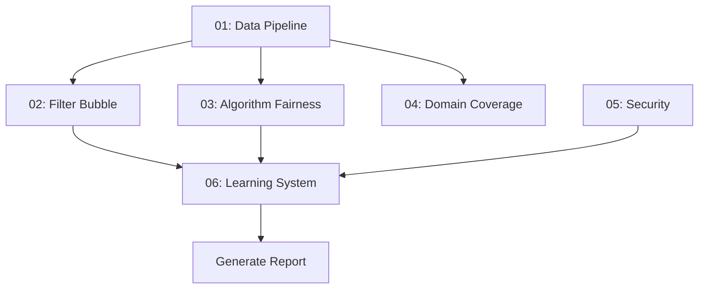

# Master Audit Orchestrator

**Purpose:** Coordinate and execute all audit agents for the News & Trends V2 system
**Output:** Comprehensive audit report with prioritized findings and remediation plan

## Quick Start

```bash
# Run full audit suite
claude -p "Execute the master audit orchestrator at audit-agents/00-master-orchestrator.md for the News & Trends V2 system"

# Run specific audit only
claude -p "Run audit-agents/02-filter-bubble-auditor.md on the News & Trends system"
```

## Audit Agents Summary

| # | Agent | Focus Area | Critical Checks |
|---|-------|------------|-----------------|
| 01 | Data Pipeline Quality | Data ingestion, schema, deduplication | Schema integrity, data freshness |
| 02 | Filter Bubble & Diversity | Anti-echo-chamber mechanisms | 70/30 split, domain coverage |
| 03 | Algorithm Fairness | Bias detection across groups | Org type parity, cold start fairness |
| 04 | Domain Coverage | Keyword & entity completeness | 12 domains, all states, politicians |
| 05 | Security & Compliance | RLS, auth, data protection | Data isolation, injection prevention |
| 06 | Learning System | Affinity learning, decay, feedback loops | Stability, convergence, cold start |

## Execution Order

Audits should be run in this order (dependencies noted):



1. **Phase 1 - Foundation** (parallel)
   - 01: Data Pipeline Quality Auditor
   - 05: Security & Compliance Auditor

2. **Phase 2 - Classification** (after Phase 1)
   - 04: Domain Coverage Auditor

3. **Phase 3 - Personalization** (after Phase 2)
   - 02: Filter Bubble & Diversity Auditor
   - 03: Algorithm Fairness Auditor

4. **Phase 4 - Learning** (after Phase 3)
   - 06: Learning System Auditor

5. **Phase 5 - Report Generation**
   - Compile all findings
   - Prioritize by severity
   - Generate remediation plan

## Pre-Audit Checklist

Before running audits, verify:

- [ ] Database access is available (Supabase credentials)
- [ ] All migration files have been applied
- [ ] Edge Functions are deployed
- [ ] Sample data exists for testing
- [ ] Scheduled jobs are configured

## Audit Execution Template

For each audit agent, follow this process:

### Step 1: Read the Audit Document
```bash
claude -p "Read audit-agents/[XX-agent-name].md and list all checks"
```

### Step 2: Examine Required Files
Review all files listed in the "Files to Examine" sections.

### Step 3: Execute Validation Queries
Run SQL queries against the database and record results.

### Step 4: Code Review
Check code patterns against the checklist items.

### Step 5: Document Findings
Use the finding template for each issue discovered.

### Step 6: Assign Severity
- **CRITICAL:** System is broken, security vulnerability, data loss risk
- **HIGH:** Major functionality impaired, significant bias/unfairness
- **MEDIUM:** Functionality degraded, minor bias, potential issues
- **LOW:** Edge cases, minor improvements, cosmetic issues
- **INFO:** Observations, recommendations, best practices

## Consolidated Findings Report Template

```markdown
# News & Trends V2 Audit Report
**Date:** [YYYY-MM-DD]
**Auditor:** Claude AI
**Version:** 1.0

## Executive Summary

### Overall Health Score: [A/B/C/D/F]

| Category | Status | Critical | High | Medium | Low |
|----------|--------|----------|------|--------|-----|
| Data Pipeline | [PASS/FAIL] | 0 | 0 | 0 | 0 |
| Filter Bubble | [PASS/FAIL] | 0 | 0 | 0 | 0 |
| Fairness | [PASS/FAIL] | 0 | 0 | 0 | 0 |
| Domain Coverage | [PASS/FAIL] | 0 | 0 | 0 | 0 |
| Security | [PASS/FAIL] | 0 | 0 | 0 | 0 |
| Learning System | [PASS/FAIL] | 0 | 0 | 0 | 0 |

### Top 5 Priority Issues
1. [CRITICAL] Issue title - Brief description
2. [HIGH] Issue title - Brief description
3. ...

---

## Detailed Findings

### Data Pipeline Quality Audit
[Findings from 01-data-pipeline-auditor.md]

### Filter Bubble & Diversity Audit
[Findings from 02-filter-bubble-auditor.md]

### Algorithm Fairness Audit
[Findings from 03-algorithm-fairness-auditor.md]

### Domain Coverage Audit
[Findings from 04-domain-coverage-auditor.md]

### Security & Compliance Audit
[Findings from 05-security-compliance-auditor.md]

### Learning System Audit
[Findings from 06-learning-system-auditor.md]

---

## Remediation Plan

### Immediate (This Week)
- [ ] [CRITICAL findings]

### Short-term (This Month)
- [ ] [HIGH findings]

### Medium-term (This Quarter)
- [ ] [MEDIUM findings]

### Backlog
- [ ] [LOW/INFO findings]

---

## Appendix

### A. Query Results
[Raw data from validation queries]

### B. Code Samples
[Relevant code snippets]

### C. Test Evidence
[Screenshots, logs, test outputs]
```

## Key Metrics to Track

### System Health Dashboard

| Metric | Target | Current | Status |
|--------|--------|---------|--------|
| Domain tagging rate | >80% | ? | ? |
| Geographic tagging rate | >60% | ? | ? |
| NEW_OPPORTUNITY rate | 15-30% | ? | ? |
| Affinity score extremes | <10% | ? | ? |
| Cold start score avg | >40 | ? | ? |
| Cross-org data leaks | 0 | ? | ? |
| RLS policy coverage | 100% | ? | ? |
| Keyword collision rate | <5% | ? | ? |

### Fairness Metrics

| Metric | Target | Current | Status |
|--------|--------|---------|--------|
| Score variance by org type | <2x | ? | ? |
| New vs established org avg | >80% | ? | ? |
| Domain score variance | <10pts | ? | ? |
| Geographic score variance | <15pts | ? | ? |

## Automated Monitoring Setup

For ongoing audit capabilities, set up:

### 1. Daily Checks
```sql
-- Data freshness check
SELECT source_type, MAX(indexed_at), NOW() - MAX(indexed_at) as age
FROM trend_evidence
GROUP BY source_type
HAVING NOW() - MAX(indexed_at) > INTERVAL '6 hours';

-- Out-of-bounds affinity check
SELECT COUNT(*) FROM org_topic_affinities
WHERE affinity_score < 0.2 OR affinity_score > 0.95;
```

### 2. Weekly Checks
```sql
-- Domain distribution balance
SELECT unnest(policy_domains) as domain, COUNT(*)
FROM trend_events
WHERE created_at > NOW() - INTERVAL '7 days'
GROUP BY domain;

-- Decay job verification
SELECT last_run FROM scheduled_jobs
WHERE function_name = 'decay-stale-affinities';
```

### 3. Monthly Checks
- Full fairness metrics calculation
- Feedback loop analysis
- Cold start success rate
- Keyword coverage review

## Post-Audit Actions

After completing the audit:

1. **Triage Findings:** Group by severity and effort
2. **Create Issues:** File tickets for each finding
3. **Assign Owners:** Designate responsible parties
4. **Set Deadlines:** Based on severity
5. **Schedule Follow-up:** Re-audit after fixes
6. **Document Lessons:** Update audit checklists

## Continuous Improvement

After each audit cycle:

1. Update keyword lists based on Domain Coverage findings
2. Tune learning parameters based on Learning System findings
3. Add new checks based on emerging patterns
4. Remove checks that are no longer relevant
5. Update severity guidelines based on real-world impact

---

## Appendix: Full Audit Checklist Summary

### Data Pipeline (01)
- [ ] Schema integrity (PKs, FKs, indexes)
- [ ] Data ingestion error handling
- [ ] Deduplication effectiveness
- [ ] Policy domain tagging accuracy
- [ ] Geographic tagging accuracy
- [ ] Data freshness monitoring

### Filter Bubble (02)
- [ ] Anti-filter-bubble mechanisms work
- [ ] 70/30 scoring split maintained
- [ ] Domain coverage enforced
- [ ] Decay mechanism runs
- [ ] Filter log analysis
- [ ] Echo chamber detection tests

### Algorithm Fairness (03)
- [ ] Scoring bias by org type
- [ ] Cold start fairness
- [ ] Geographic bias
- [ ] Domain bias
- [ ] Scoring transparency
- [ ] Feedback loop risk
- [ ] Political neutrality

### Domain Coverage (04)
- [ ] Keyword completeness (50+ per domain)
- [ ] Keyword collision detection
- [ ] Entity recognition accuracy
- [ ] Geographic pattern coverage
- [ ] Source-to-domain mapping
- [ ] False positive/negative rates

### Security (05)
- [ ] RLS policies on all org tables
- [ ] Data leakage prevention
- [ ] Authentication in all functions
- [ ] Injection vulnerability scan
- [ ] Data retention compliance
- [ ] Audit trail completeness
- [ ] Service key usage audit

### Learning System (06)
- [ ] EMA formula correctness
- [ ] Decay mechanism effectiveness
- [ ] Feedback loop stability
- [ ] Cold start handling
- [ ] Correlation quality
- [ ] 70/30 architecture integrity
