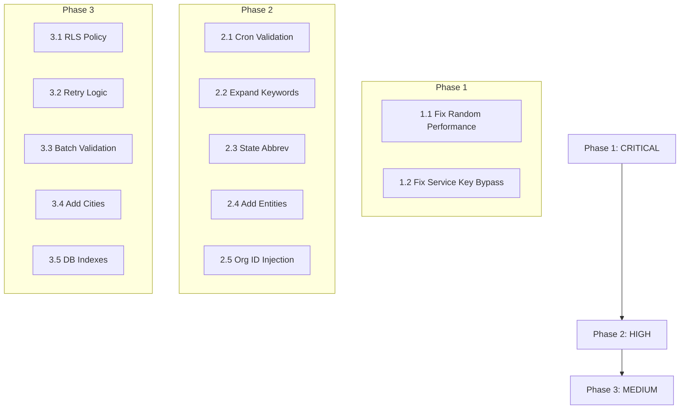

# News & Trends V2 Remediation Plan

**Based on:** AUDIT-REPORT-2026-01-19.md
**Created:** 2026-01-19
**Status:** Ready for Execution

---

## Executive Summary

This plan addresses **2 CRITICAL**, **5 HIGH**, and selected **MEDIUM** issues identified in the audit.
Four specialized remediation agents have been created to execute fixes across different domains.

---

## Agent Assignments

| Agent | Focus Area | Issues Assigned |
|-------|------------|-----------------|
| `10-security-remediator.md` | RLS, Auth, Service Keys | 4 issues |
| `11-content-enhancer.md` | Keywords, Entities, Coverage | 6 issues |
| `12-algorithm-fixer.md` | Logic Bugs, Performance | 4 issues |
| `13-schema-migrator.md` | RLS Policies, Indexes | 3 issues |

---

## Phase 1: CRITICAL Fixes (Immediate)

### 1.1 Fix Random Performance Data Placeholder
**Agent:** `12-algorithm-fixer.md`
**Priority:** CRITICAL
**File:** `supabase/functions/correlate-trends-campaigns/index.ts:200`

**Issue:** Learning system uses `Math.random()` instead of actual campaign performance metrics.

**Fix:**
```typescript
// Replace placeholder with actual performance calculation
const performance = await calculateCampaignPerformance(campaign, supabaseClient);
```

**Verification:** Run correlation function and verify performance values are derived from real metrics.

---

### 1.2 Fix Service Key Bypass in get-trends-for-org
**Agent:** `10-security-remediator.md`
**Priority:** CRITICAL
**File:** `supabase/functions/get-trends-for-org/index.ts:142-143`

**Issue:** User-facing API bypasses RLS by using `SUPABASE_SERVICE_ROLE_KEY`.

**Fix:**
- Create user-scoped client for data queries (use JWT from request)
- Keep service role only for initial auth validation if needed
- Ensure all data queries go through user-scoped client

**Verification:** Test that users can only access their own organization's data.

---

## Phase 2: HIGH Priority Fixes

### 2.1 Replace Fail-Open Cron Validation (5 Functions)
**Agent:** `10-security-remediator.md`
**Priority:** HIGH

**Affected Files:**
- `supabase/functions/tag-trend-policy-domains/index.ts`
- `supabase/functions/tag-trend-geographies/index.ts`
- `supabase/functions/update-org-affinities/index.ts`
- `supabase/functions/decay-stale-affinities/index.ts`
- `supabase/functions/correlate-trends-campaigns/index.ts`

**Fix:** Import and use shared `validateCronSecret` from `_shared/security.ts`:
```typescript
import { validateCronSecret } from '../_shared/security.ts';
// Remove local validateCronSecret implementations
```

---

### 2.2 Expand Policy Domain Keywords
**Agent:** `11-content-enhancer.md`
**Priority:** HIGH
**File:** `supabase/functions/_shared/policyDomainKeywords.ts`

**Current State:** 23-34 keywords per domain (avg 27.3)
**Target:** 50+ keywords per domain

**Priority Domains (lowest count):**
1. Housing: 23 keywords → 50+
2. Criminal Justice: 24 keywords → 50+
3. Voting Rights: 24 keywords → 50+
4. All others: Expand to 50+

---

### 2.3 Fix State Abbreviation Matching
**Agent:** `12-algorithm-fixer.md`
**Priority:** HIGH
**File:** `supabase/functions/_shared/politicalEntities.ts:169`

**Issue:** `includes()` without word boundaries causes false positives (e.g., "any" matches NY).

**Fix:**
```typescript
// Replace: text.includes(abbrev)
// With: new RegExp(`\\b${abbrev}\\b`, 'i').test(text)
```

---

### 2.4 Add Missing Entities
**Agent:** `11-content-enhancer.md`
**Priority:** HIGH
**File:** `supabase/functions/_shared/politicalEntities.ts`

**Add:**
- Cabinet members (8+ positions)
- State governors (50)
- Missing Supreme Court justices (6)
- Federal agencies (FDA, CDC, HUD, DOE, EPA, etc.)

---

### 2.5 Fix update-org-affinities Org ID Injection
**Agent:** `10-security-remediator.md`
**Priority:** HIGH
**File:** `supabase/functions/update-org-affinities/index.ts`

**Issue:** Function accepts `org_id` from request body, allowing potential unauthorized access.

**Fix:** Extract org_id from authenticated user's JWT claims, not request body.

---

## Phase 3: MEDIUM Priority Fixes

### 3.1 Add trend_filter_log User SELECT Policy
**Agent:** `13-schema-migrator.md`
**Priority:** MEDIUM

**Fix:** Create migration to add RLS policy:
```sql
CREATE POLICY "Users can view own org filter logs"
ON trend_filter_log FOR SELECT
USING (organization_id IN (
  SELECT id FROM client_organizations
  WHERE user_id = auth.uid()
));
```

---

### 3.2 Add Missing Retry Logic
**Agent:** `12-algorithm-fixer.md`
**Priority:** MEDIUM
**Files:** Ingestion functions

**Fix:** Implement exponential backoff retry wrapper for external API calls.

---

### 3.3 Add Max Batch Size Validation
**Agent:** `12-algorithm-fixer.md`
**Priority:** MEDIUM

**Fix:** Add validation to prevent memory issues:
```typescript
const MAX_BATCH_SIZE = 1000;
if (items.length > MAX_BATCH_SIZE) {
  throw new Error(`Batch size ${items.length} exceeds max ${MAX_BATCH_SIZE}`);
}
```

---

### 3.4 Add Missing Cities
**Agent:** `11-content-enhancer.md`
**Priority:** MEDIUM
**File:** `supabase/functions/_shared/politicalEntities.ts`

**Add top-50 US cities currently missing (12 cities).**

---

### 3.5 Add Missing Database Indexes
**Agent:** `13-schema-migrator.md`
**Priority:** MEDIUM/LOW

**Add:**
- Index on `campaign_type` column
- NOT NULL constraint on `priority_bucket`

---

## Execution Order



---

## Verification Checklist

After each phase, run the corresponding audit agent to verify fixes:

- [ ] **Phase 1 Complete:** Run `05-security-compliance-auditor.md` and `06-learning-system-auditor.md`
- [ ] **Phase 2 Complete:** Run `04-domain-coverage-auditor.md` and `05-security-compliance-auditor.md`
- [ ] **Phase 3 Complete:** Run full audit suite with `00-master-orchestrator.md`

---

## Success Criteria

| Metric | Before | Target |
|--------|--------|--------|
| CRITICAL Issues | 2 | 0 |
| HIGH Issues | 5 | 0 |
| MEDIUM Issues | 13 | ≤5 |
| Keywords per Domain | 27.3 avg | 50+ |
| Entity Coverage | 32% | 80%+ |
| RLS Coverage | 83% | 100% |
| Learning System | BLOCKED | FUNCTIONAL |

---

## Rollback Plan

Each phase should be committed separately to allow targeted rollback:
1. `fix/critical-learning-system-performance`
2. `fix/critical-service-key-rls`
3. `fix/high-cron-validation`
4. `fix/high-domain-keywords`
5. `fix/high-entity-coverage`
6. `fix/high-state-matching`
7. `fix/medium-rls-policies`
8. `fix/medium-retry-logic`
